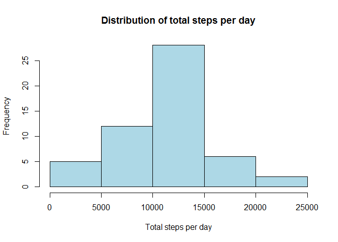
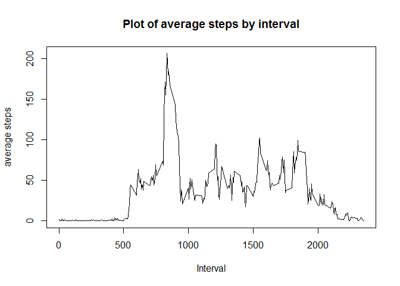
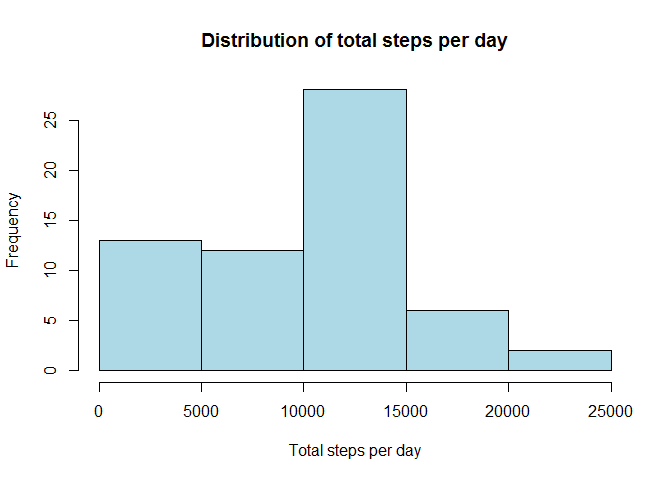
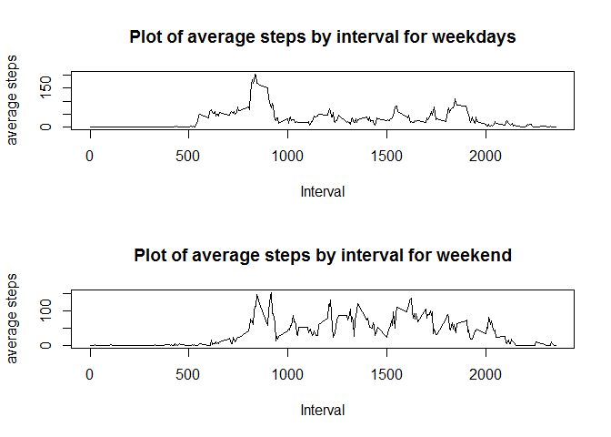

# Reproducible Research: Peer Assessment 1

Author  : Akash Chauhan  
Date    : 15th Feb 2015


## Loading and preprocessing the data

The current directory is set to the forked repo directory.
Unzip the activity.zip file and then read the csv file using the following command - 


```r
activity <- read.csv("activity.csv")
```

A quick view of the loaded dataset :


```r
head(activity)
```

```
##   steps       date interval
## 1    NA 2012-10-01        0
## 2    NA 2012-10-01        5
## 3    NA 2012-10-01       10
## 4    NA 2012-10-01       15
## 5    NA 2012-10-01       20
## 6    NA 2012-10-01       25
```


## What is mean total number of steps taken per day?

Find out the total no. of steps per day using the following code -


```r
act_sum <- aggregate(activity$steps, by=list(activity$date), FUN="sum")
names(act_sum) <- c("Date", "total_steps")
head(act_sum)
```

```
##         Date total_steps
## 1 2012-10-01          NA
## 2 2012-10-02         126
## 3 2012-10-03       11352
## 4 2012-10-04       12116
## 5 2012-10-05       13294
## 6 2012-10-06       15420
```

plot a histogram for the total no. of steps:


```r
hist(act_sum$total_steps,col="lightblue", main="Distribution of total steps per day",xlab="Total steps per day")
```

 

Mean and median of total steps per day:


```r
mean(act_sum$total_steps, na.rm=TRUE)
```

```
## [1] 10766.19
```

```r
median(act_sum$total_steps, na.rm=TRUE)
```

```
## [1] 10765
```


## What is the average daily activity pattern?

calculate the average no. of steps by time interval across all dates:


```r
stepbyint <- aggregate(activity$steps, by=list(activity$interval), FUN="mean", na.rm=TRUE)
names(stepbyint) <- c("Interval", "avg_steps")
head(stepbyint)
```

```
##   Interval avg_steps
## 1        0 1.7169811
## 2        5 0.3396226
## 3       10 0.1320755
## 4       15 0.1509434
## 5       20 0.0754717
## 6       25 2.0943396
```

```r
plot(stepbyint$Interval, stepbyint$avg_steps, type="l", main="Plot of average steps by interval", xlab="Interval", ylab="average steps")
```

 

finding out the maximum steps interval:


```r
stepbyint[stepbyint$avg_steps == max(stepbyint$avg_steps),]$Interval
```

```
## [1] 835
```

## Imputing missing values

Find out the no. of rows with NA values


```r
nrow(activity[is.na(activity),])
```

```
## [1] 2304
```


Replacing the missing NA values of steps with the median steps for that interval


```r
actwona <- activity[!is.na(activity$steps),]
stepbyint <- aggregate(actwona$steps, by=list(actwona$interval), FUN="median")
names(stepbyint) <- c("interval", "steps_new")
head(stepbyint)
```

```
##   interval steps_new
## 1        0         0
## 2        5         0
## 3       10         0
## 4       15         0
## 5       20         0
## 6       25         0
```

creating a new dataset with the missing steps replaced with the new steps


```r
act1 <- merge(activity, stepbyint, by="interval")
act2 <- act1[!is.na(act1$steps),]
act3 <- act1[is.na(act1$steps),]
act2 <- act2[,c("interval","steps","date")]
act3 <- act3[,c("interval","steps_new","date")]
names(act3)[2] <- "steps"
act_new <- rbind(act2, act3)
act_new <- act_new[order(act_new$date, act_new$interval),]
head(act_new)
```

```
##     interval steps       date
## 1          0     0 2012-10-01
## 63         5     0 2012-10-01
## 128       10     0 2012-10-01
## 205       15     0 2012-10-01
## 264       20     0 2012-10-01
## 327       25     0 2012-10-01
```


The following is a repeat of the previous steps to create a histogram:


```r
act_sum <- aggregate(act_new$steps, by=list(act_new$date), FUN="sum")
names(act_sum) <- c("Date", "total_steps")
head(act_sum)
```

```
##         Date total_steps
## 1 2012-10-01        1141
## 2 2012-10-02         126
## 3 2012-10-03       11352
## 4 2012-10-04       12116
## 5 2012-10-05       13294
## 6 2012-10-06       15420
```

```r
hist(act_sum$total_steps,col="lightblue", main="Distribution of total steps per day",xlab="Total steps per day")
```

 

```r
mean(act_sum$total_steps, na.rm=TRUE)
```

```
## [1] 9503.869
```

```r
median(act_sum$total_steps, na.rm=TRUE)
```

```
## [1] 10395
```

The histogram and mean/median values clearly have changed from before.


## Are there differences in activity patterns between weekdays and weekends?


Add week day variable to the new dataset and create a panel plot for
either weekday or weekend.


```r
act_new$wkd <- weekdays(as.Date(act_new$date,format="%Y-%m-%d"))
act_new$wk <- ifelse(act_new$wkd == "Saturday", "Weekend", ifelse(act_new$wkd == "Sunday", "Weekend", "Weekday"))

par(mfrow=c(2,1))
act_new_wkd <- act_new[act_new$wk == "Weekday",]
act_new_wkend <- act_new[act_new$wk == "Weekend",]

stepbyint1 <- aggregate(act_new_wkd$steps, by=list(act_new_wkd$interval), FUN="mean", na.rm=TRUE)
names(stepbyint1) <- c("Interval", "avg_steps")
plot(stepbyint1$Interval, stepbyint1$avg_steps, type="l", main="Plot of average steps by interval for weekdays", xlab="Interval", ylab="average steps")


stepbyint2 <- aggregate(act_new_wkend$steps, by=list(act_new_wkend$interval), FUN="mean", na.rm=TRUE)
names(stepbyint2) <- c("Interval", "avg_steps")
plot(stepbyint2$Interval, stepbyint2$avg_steps, type="l", main="Plot of average steps by interval for weekend", xlab="Interval", ylab="average steps")
```

 


